# **BESS ERCOT Index (Jan–Nov 2025)**

## **Index Description**

The **BESS ERCOT Index** is a transparent **perfect foresight**, rules-based benchmark that estimates the daily arbitrage earnings of a reference battery operating in Texas across ERCOT markets.
It aggregates opportunities from **Day-Ahead Market (DAM)** and **Real-Time Market (RTM)** prices using official ERCOT data. It uses hourly DAM settlement point prices from the hub **HB_HOUSTON** and applies the **τ-greedy one-cycle method**.

- **Reference asset:** 1 MW, 2h duration, with a daily usable energy of 2 MWh. 
- **Round-Trip Efficiency:** 85%  for a full cycle.

**What the Index Represents:**
The index is a simplified benchmark for the earnings that could have been theoretically obtained with perfect information.

---

## DAM vs RTM Analysis

This section compares arbitrage opportunities for a reference battery operating in ERCOT's Day-Ahead Market (DAM) versus Real-Time Market (RTM) using the same τ-greedy one-cycle method. The goal of this analysis is not to propose an executable trading strategy, but to understand how market structure and volatility affect theoretical arbitrage revenues under perfect foresight. 

### Overview of findings
RTM generates higher total arbitrage revenue than DAM, though most days show similar performance across both markets. The difference is driven by a small number of extreme RTM spike days. RTM revenues are significantly more volatile, offering higher upside alongside deeper downside risk exposure. DAM provides smoother and more predictable revenue, capturing most of the baseline arbitrage value. The cumulative revenue gap between RTM and DAM widens primarily during periods of grid stress. Overall, RTM value is spike-driven, while DAM value is stability-driven.

### Visualization Deep Dive
#### 1. Daily Arbitrage Revenue: DAM vs RTM 
This plot shows daily arbitrage revenue for both markets over time.

**Key observations:**
- RTM exhibits sharp revenue spikes.
- DAM revenue is smoother, with fewer extreme days.
- On most days, both markets generate similar revenue levels.
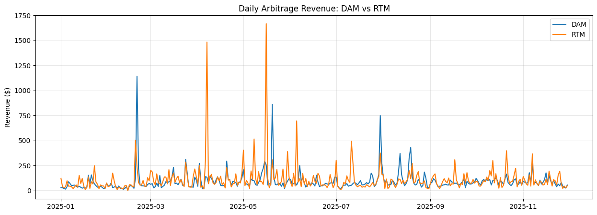

#### 2. Cumulative Arbitrage Revenue: DAM vs RTM 
This visualization accumulates daily revenues to show total arbitrage value over time.

**Key observations:**
- RTM cumulative revenue ends higher than DAM.
- Outside of extreme events, both curves grow at similar rates.
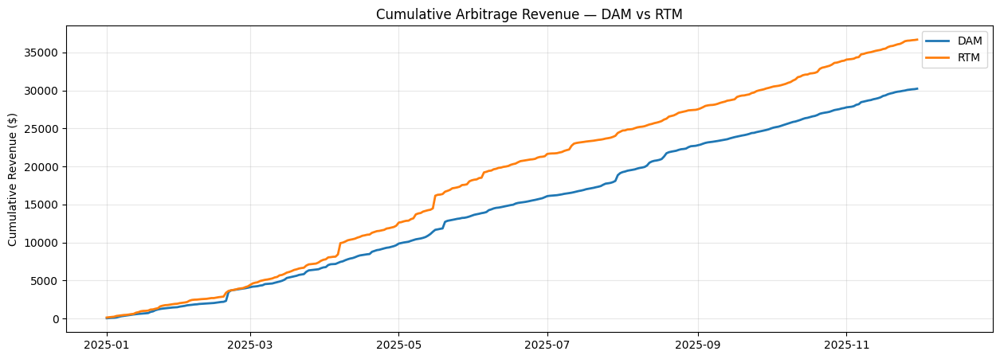

#### 3. Distribution of Daily Revenues: DAM vs RTM 
This histogram compares the frequency distribution of daily revenues.

**Key observations:**
- DAM revenues are tightly clustered with limited tail risk.
- RTM revenues exhibit a wider dispersion and a heavy right tail. 
- Extreme RTM outcomes occur infrequently but dominate the upper tail.
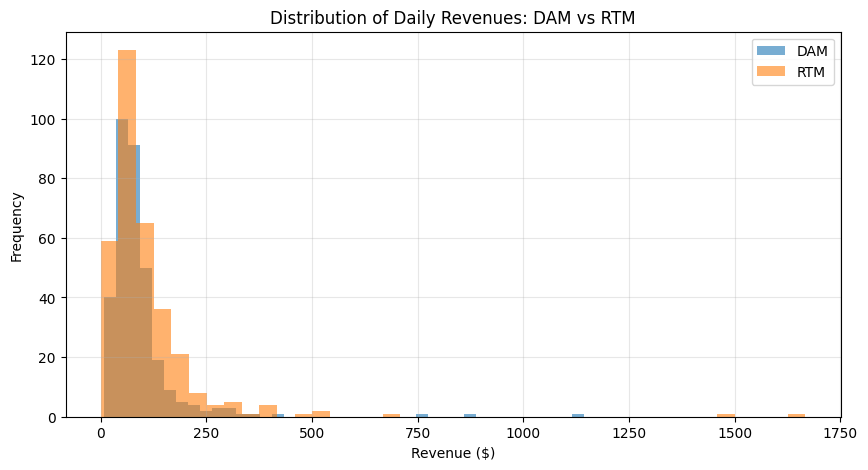

#### 4. Distribution of Daily Uplift: DAM vs RTM 
This histogram compares the frequency distribution of daily uplift.

Daily uplift is defined as:  Uplift = RTM Revenue - DAM Revenue

**Key observations:**
- A strong concentration of values near zero.
- A long right tail corresponding to extreme RTM spike days.
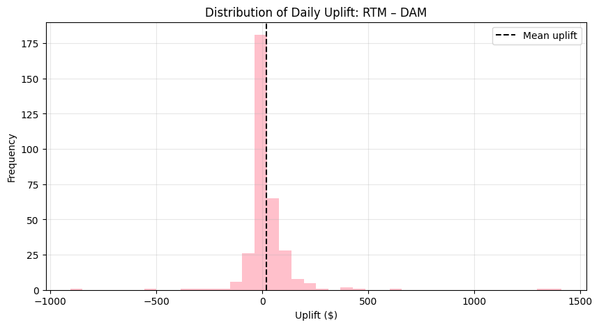

#### 5. Rolling 7-Day Revenue Volatility 
This plot shows rolling 7-day standard deviation of daily revenues.

**Key observations:**
- RTM volatility is consistently higher than DAM volatility.
- Volatility spikes align with known ERCOT stress periods (e.g., hot months).
- DAM volatility remains comparatively stable throughout the year.
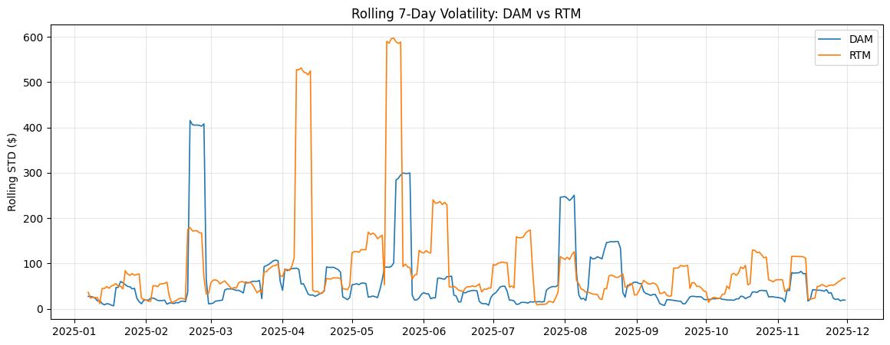

#### 6. Monthly Revenue Distributions: DAM and RTM 
Monthly boxplots provide a seasonal view of revenue behavior.

**Key observations:**
- Both DAM and RTM show higher median revenues during summer months.
- RTM exhibits wider interquartile ranges and more extreme outliers.
- DAM distributions remain comparatively compact even during high-stress periods.
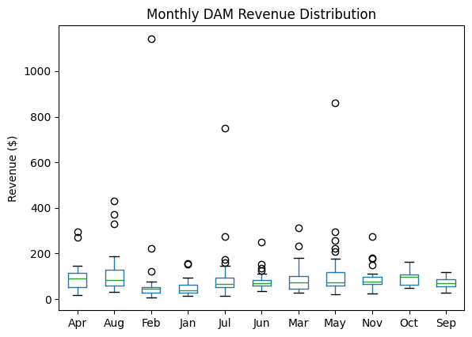
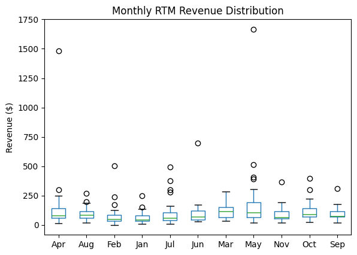

---

## **LP Optimum Comparison**
To validate the τ-greedy index as a meaningful benchmark, it is compared against the true perfect-foresight optimum obtained by solving a daily linear program (LP) for battery arbitrage. The LP solution represents the maximum achievable arbitrage revenue for a given day and therefore serves as the ground-truth benchmark against which the τ-greedy heuristic is evaluated.

### **Key Metric: Optimality Capture Ratio** 
Performance is evaluated using the optimality capture ratio:
Capture Ratio = τ-greedy Revenue / LP Optimum Revenue

This metric answers a single, precise question:
- How much of the maximum achievable arbitrage value does τ-greedy recover on a given day?

### Overview of findings
τ-greedy captures most of the theoretical arbitrage value available each day. On the majority of days, τ-greedy revenue closely matches the LP optimum. Over time, τ-greedy tracks the LP cumulative revenue closely, indicating that the heuristic sacrifices only a limited amount of optimality in exchange for simplicity and transparency.

### **Visualization Deep Dive**

#### **1. Daily Revenue Scatter: τ-greedy vs LP Optimum**
This scatter plot compares daily τ-greedy revenue against the LP optimum. 

**Key observations:**
- Most points lie close to the 45-degree line (y = x).
- τ-greedy rarely deviates dramatically from the LP solution.

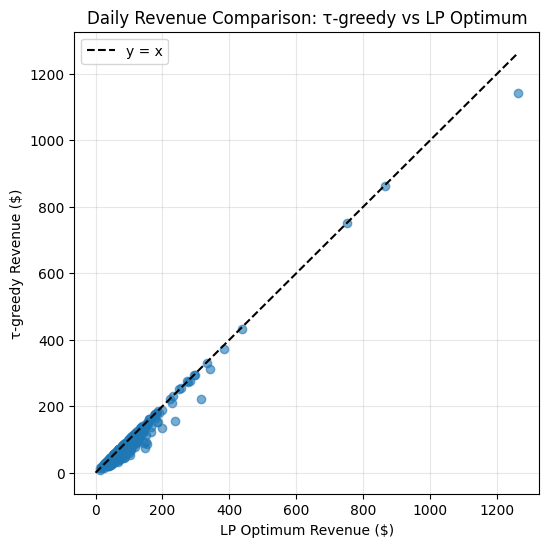

#### **2. Distribution of Optimality Capture**
This histogram shows the distribution of daily optimality capture ratios.

**Key observations:**
- A strong concentration of days with capture ratios close to 1.0.
- Median capture near the upper end of the distribution.
- A left tail corresponding to days where LP exploits more complex dispatch patterns.
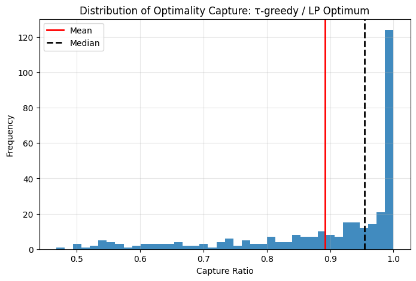

#### **3. Cumulative Revenue: τ-greedy vs LP Optimum**
This plot compares cumulative arbitrage revenue over time.

**Key observations:**
- LP cumulative revenue remains above τ-greedy, as expected.
- The gap grows gradually rather than abruptly.
- τ-greedy tracks the LP curve closely throughout the year.
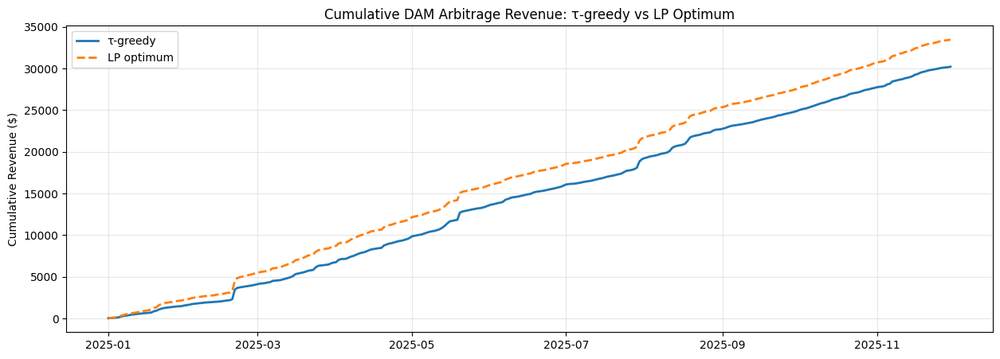

--- 

## **Algorithm Deep Dive**

The optimizer behind the index uses a heuristic algorithm called the **τ-greedy one-cycle algorithm**. The core idea is simple:

- **Split the day into two parts:** All possible “split points” (τ) are tested. Intervals before τ are treated as potential charging windows, and those after τ as potential discharging windows. This forces the model to charge before discharging.
- **Pick the best spread:** Within each split, the algorithm ranks prices: cheapest hours to buy energy first (left side) and highest prices to sell later (right side). It pairs them greedily until the battery’s energy or power limits are reached.
- **Check feasibility:** The plan is valid only if state-of-charge (SoC) stays within limits and returns to zero by the end of the day.
- **Choose the best τ:** The split that yields the highest total revenue defines the day’s optimal charge/discharge schedule.

---

## **Example (Simplified): 2-period battery, no efficiency losses**

To illustrate the logic, consider a very simple battery that can charge in two intervals and discharge in another two, with no losses (η = 1). The figure below shows all the possible split points τ that define the charge and discharge windows:
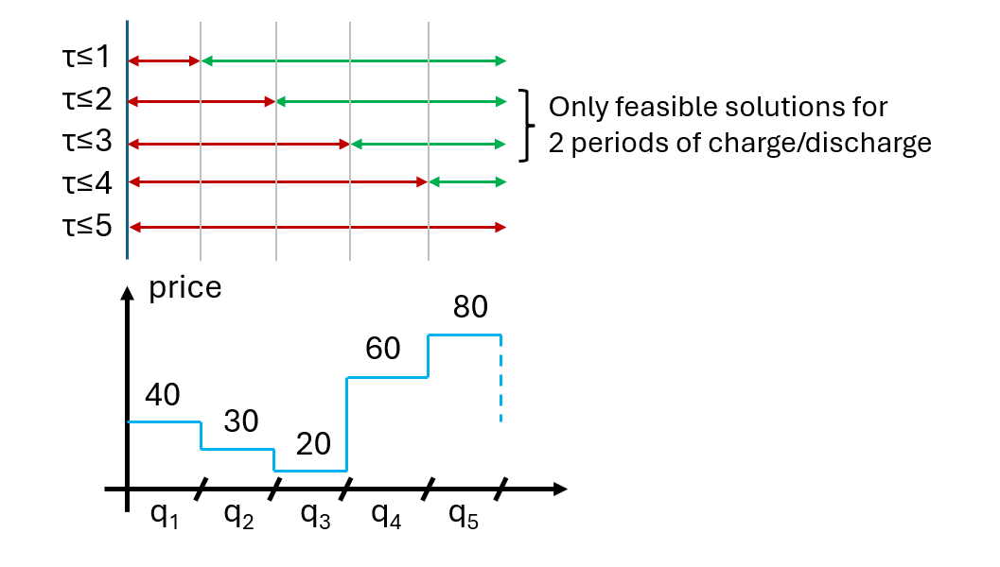

- **τ = 2** → Charge window = [40, 30]; Discharge window = [20, 60, 80]
Cheapest buys = 30, 40 ; Richest sells = 80, 60 → Spreads = (80 − 30) = 50, (60 − 40) = 20 → Total = **$70/MW**.
- **τ = 3** → Charge window = [40, 30, 20]; Discharge window = [60, 80]
Cheapest buys = 20, 30 ; Richest sells = 80, 60 → Spreads = (80 − 20) = 60, (60 − 30) = 30 → Total = **$90/MW**.

The optimizer would therefore select τ = 3, because it delivers the highest total spread ($90/MW).

*Disclaimer: Educational benchmark only. Real-world results depend on asset specifics (degradation, availability, grid limits), bidding rules, and execution frictions.*
