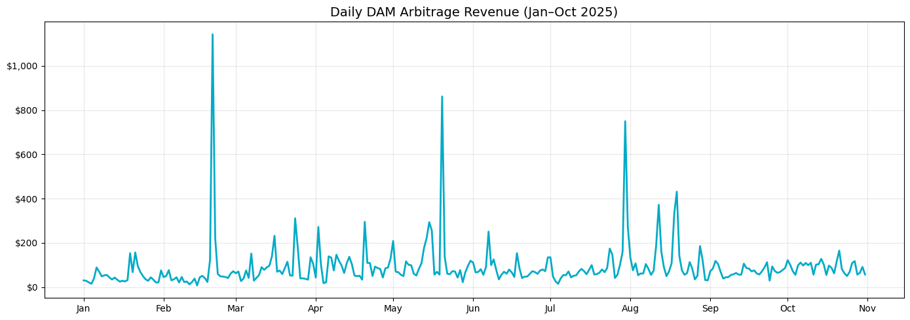
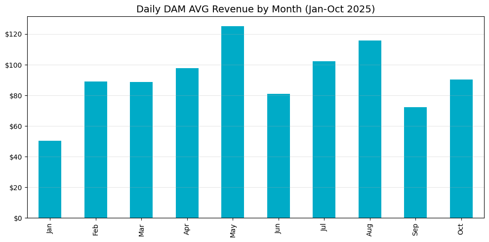
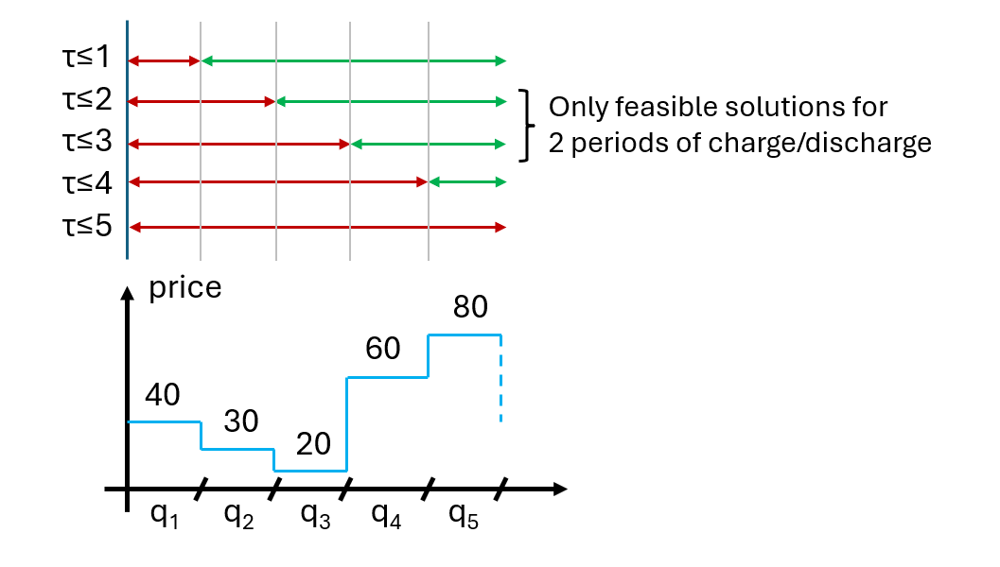

# **BESS ERCOT Index (Jan–Oct 2025)**

## **Index Description**

The **BESS ERCOT Index** is a transparent **perfect foresight**, rules-based benchmark that estimates the daily arbitrage earnings of a reference battery operating in Texas across ERCOT markets.
It aggregates opportunities from **Day-Ahead Market (DAM)** average prices, using ERCOT official files for Texas. It uses hourly DAM settlement point prices from the hub **HB_HOUSTON** and applies the **τ-greedy one-cycle method**.

- **Reference asset:** 1 MW, 2h duration, with a daily usable energy of 2 MWh. 
- **Round-Trip Efficiency:** 85%  for a full cycle.

**What the Index Represents:**
The index is a simplified benchmark for the earnings that could have been theoretically been obtained with perfect information.

---

## **Algorithm Deep Dive**

The optimizer behind the index uses a heuristic algorithm called the **τ-greedy one-cycle algorithm**. The core idea is simple:

- **Split the day into two parts:** All possible “split points” (τ) are tested. Intervals before τ are treated as potential charging windows, and those after τ as potential discharging windows. This forces the model to charge before discharging.
- **Pick the best spread:** Within each split, the algorithm ranks prices: cheapest hours to buy energy first (left side) and highest prices to sell later (right side). It pairs them greedily until the battery’s energy or power limits are reached.
- **Check feasibility:** The plan is valid only if state-of-charge (SoC) stays within limits and returns to zero by the end of the day.
- **Choose the best τ:** The split that yields the highest total revenue defines the day’s optimal charge/discharge schedule.

---

## **Example (Simplified): 2-period battery, no efficiency losses**

To illustrate the logic, consider a very simple battery that can charge in two intervals and discharge in another two, with no losses (η = 1). The figure below shows all the possible split points τ that defines the charge and discharge windows:

- **τ = 2** → Charge window = [40, 30]; Discharge window = [20, 60, 80]
Cheapest buys = 30, 40 ; Richest sells = 80, 60 → Spreads = (80 − 30) = 50, (60 − 40) = 20 → Total = **$70/MW**.
- **τ = 3** → Charge window = [40, 30, 20]; Discharge window = [60, 80]
Cheapest buys = 20, 30 ; Richest sells = 80, 60 → Spreads = (80 − 20) = 60, (60 − 30) = 30 → Total = **$90/MW**.

The optimizer would therefore select τ = 3, because it delivers the highest total spread ($90/MW).

*Disclaimer: Educational benchmark only. Real-world results depend on asset specifics (degradation, availability, grid limits), bidding rules, and execution frictions.*
